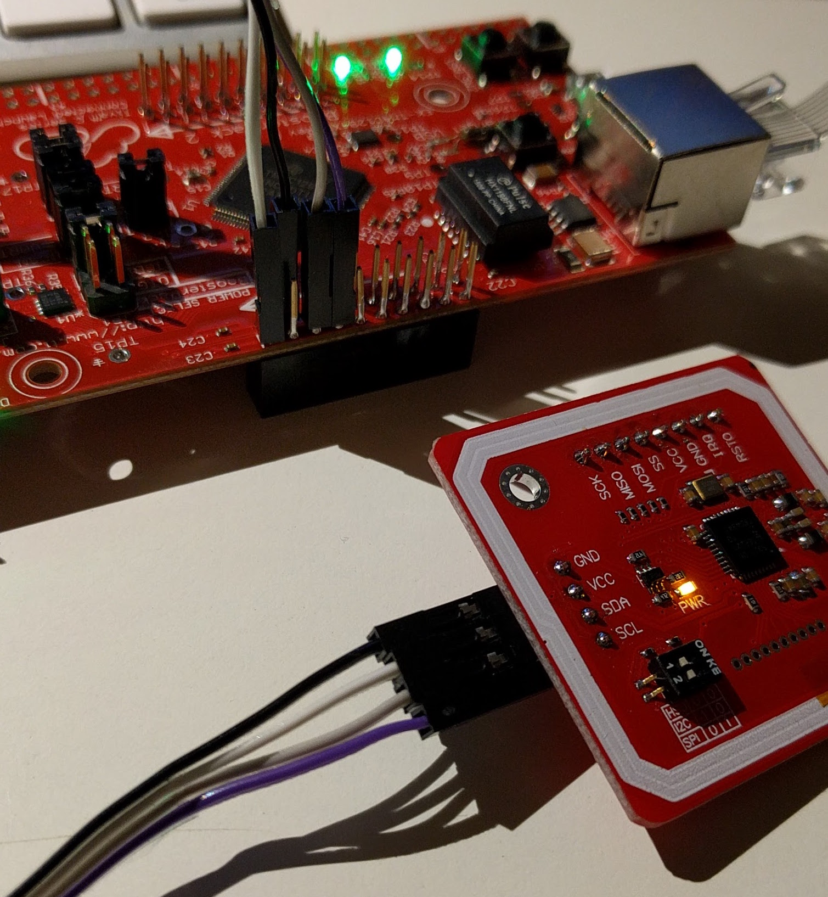

[](https://travis-ci.org/londonhackspace/acnode-cl)

Table of Contents
=================

  * [Table of Contents](#table-of-contents)
  * [Features](#features)
  * [Parts list](#parts-list)
    * [For the transistor switch](#for-the-transistor-switch)
    * [For the rest of the node:](#for-the-rest-of-the-node)
    * [Making the transistor switch](#making-the-transistor-switch)
    * [Wiring in the arcade switch](#wiring-in-the-arcade-switch)
    * [How to get this running with a cooqrobot/elechouse pn532 breakout board:](#how-to-get-this-running-with-a-cooqrobotelechouse-pn532-breakout-board)
    * [Using the tool running pin](#using-the-tool-running-pin)
  * [Building and flashing the firmware](#building-and-flashing-the-firmware)
  * [Pin assignments:](#pin-assignments)
  * [using the CLI](#using-the-cli)
  * [Roles](#roles)
  * [Button status/colours:](#button-statuscolours)
  * [To use the button menu:](#to-use-the-button-menu)
    * [For maintainers the menu items are:](#for-maintainers-the-menu-items-are)
    * [So for a user to take a tool out of service:](#so-for-a-user-to-take-a-tool-out-of-service)
    * [For a maintainer to access the menu and do nothing:](#for-a-maintainer-to-access-the-menu-and-do-nothing)
    * [For a maintainer to add a card:](#for-a-maintainer-to-add-a-card)
  * [Glossary](#glossary)
    * [Offline and Online](#offline-and-online)
    * [In service and Out of service](#in-service-and-out-of-service)

# Features

* Command line interface for settings over the usb port

* Stores settings in eeprom

* Can log to a syslog server

* Uses DHCP to get it's ip address

* Optional pin to detect when a tool is running - good for detecting when consumables are being used

* Can record the total runtime of of the tool if the tool running pin is used.

* Button with RGB led for status.

* Single Button menu for adding cards and putting a tool off and online.

* Can cache 752 cards to the embedded eeprom.

# Parts list

## For the transistor switch

* 1 x NPN transistor, i used a 2N3904
* 1 x 1K resistor
* 1 x small bit (8 x 8 holes is fine) of Vero board
* 2 x C shaped crimp or solderable terminals for the relay
* 2 x wires with female header socket ends (the other end doesn't matter, and will be cut off), one black, and one red.
* 1 x black female to female header socket lead
* 1 x grey female to female header socket lead

## For the rest of the node:

* 2 x crimp or solderable spade terminals for the microswitch on the arcade button
* 2 x wires with female header socket ends (the other end doesn't matter, and will be cut off), one black & one white
* 1 x PN532 based card reader
* 1 x connected Launchpad
* 1 x red  female to female header socket lead
* 1 x blue female to female header socket lead
* 1 x green female to female header socket lead
* 1 x black female to female header socket lead

##  Making the transistor switch

* cut one end off the 2 wires with header socket ends, leaving as much wire
as possible and the female ends

* Strip the bare end crimp into the terminals - for the arcade button
terminals use a white and black wire, and for the relay use red and black
wires.

* Attach the red wire to the+ side of the VDC connections on the SSR and the
black one to the - side.

* Attach the red female and to +5v header pin on the launchpad

* On some strip board solder the transistor on one edge with the flat side
facing the rest of the board.

* Cut the track connected to the middle (base) pin of the transistor in the
middle of the board

* Solder the 1K resistor over the hole you've cut

* Solder a 3 pin header so the middle pin goes header -> 1k resistor ->
middle (base) of the transistor, and the left and right pins are connected
to the left and right pin of the transistor

Picture of stripboard + transistor + header:

https://pointless.net/photos/id/1419346624/

Picture of the bottom showing cut track:

https://pointless.net/photos/id/1419346632/

* with the header pins towards you looking edge on at the board (the flat
side of the transistor should be facing you), the pins are, from left to
right:

* 1 connect to GND on the connected launchpad with a black female to female lead.
* 2 connect to PG_1 on the connected launchpad
* 3 connect to - on the ssr VDC side with the black lead you made eairler

## Wiring in the arcade switch

* make two spade terminal leads, one white and one black

like this:

https://pointless.net/photos/id/1419334749/

* connect the black one to the bottom of the microswitch on the button and the other end to a convenient GND on the launchpad

* connect the white end to the terminal labelled "NO" on the microswitch, and the other end to PF_1 on the launchpad

* connect the white lead of the RGB led leads to +5V on the launchpad

* the RGB red, green and blue leads go to PM0, PM1 and PM2

## How to get this running with a cooqrobot/elechouse pn532 breakout board:



1. Cooqrobot boards: Carefully unsolder the 0 ohm resistor jumper from the HIS0 connector, then resolder it (or just bridge the pads with solder) so that the '0' side is connected rather than the 1, this puts the reader in HSU mode.
  Elechouse boards: Set the DIP switches both to the right (This is as shipped from the factory) to put the reader into HSU mode.

2. Solder headers onto the 8 pin connector on the board where the TX/RX pins are, you need at least TX,RX,5V,GND. N.B. Cooqrobot boards: you can't use the SCL/SDA pins on the 4 pin connector because they have pullups on them...

2. Connect 5v and GND to somewhere convenient on the connected launchpad

4. This sketch uses Serial6 which uses PP0 and PP1, AKA pins 43 and 44 on the connected launchpad, connect those too, PP0 goes to TX on the board and PP1 to RX.

5. Check the labels on the card reader boards carefully, one cheap reader board has the pins for the FTDI cable pinouts *backwards* on the top (component) side of the board. Also some card readers label TX and RX the other way round... Do not use cheap Elechouse NFC Reader V3 clones - they often have the wrong component values in their antenna matching stage, and cannot energise cards well. Genuine Elechouse NFC Reader V4 (Direct from Elechouse, work well, the extra price is worth it for avoiding the hassle of deploying an under-performing reader).

See here for the Connected Launchpad pinouts:

http://energia.nu/pin-maps/guide_tm4c129launchpad/

## Using the tool running pin

You can send a signal to the acnode via pin PE_4 to say when your tool is actually running (as opposed to being switched on), useful for keeping track of wear and tear and consumables etc.

# Building and flashing the firmware

(non-PlatformIO version, tested on MacOS 10.12.6, 10.14.4 and Ubuntu 18.04)

* Install git for your platform if you haven't already
* Install cmake for your platform (http://cmake.org , debian/ubuntu package: cmake, MacOS homebrew: `brew install cmake`)
* Create a build directory `mkdir build`
* Run `./gettoolchain.sh`
* Use cmake to make a Makefile, and define your target board (EK-TM4C1294XL)
  `cd build && cmake .. -DCMAKE_TOOLCHAIN_FILE=../targets/tivac-launchpad/EK-TM4C1294XL.cmake`
  If building on MacOS, you may need to put the cmake binary on your path if you downloaded it manually or refer to it as
  /Applications/CMake.app/Contents/bin/cmake
* Update/initialise the git submodules `git submodule update --init`
* Use Gnu make to actually run the dependencies, compile and link: `make -j`
* When ready to upload the resultant elf binary to the Launchpad, `make -j flash`

# Pin assignments:

* PG_1 - active high, switches power to the tool, output
* PF_1 - the button, active low (uses internal pulllup), input
* PM_0 - RGB button Red channel, output
* PM_1 - RGB button Green channel, output
* PM_2 - RGB button Blue channel, output
* PP_0 - Serial RX from the card reader, input (should connect to TX on the card reader)
* PP_1 - Serial TX to the card reader, output (should connect to RX on the card reader)
* PE_4 - tool running pin, active low (uses internal pullup), input
* PD_0 - SD Card MISO (pin 7) aka D0
* PD_1 - SD Card MOSI (pin 2) aka CMD
* PD_3 - SD card clock (pin 5)
* PC_7 - SD card CS (pin 1) aka CD

# Pin assignments on ACNode shield rev 1 board (square PCB)

Other ACnode PCBs are available

* P1 connector (numbers rising towards on-board relay, P1_1 is furthest from it)
* P1_1 GND -> CAT5 ORANGE
* P1_2 +3.3V    NOT CONNECTED
* P1_3 PP0 RX ->  CAT5 WHITE/GREEN -> PN532 TXD
* P1_4 PP1 TX -> CAT5 GREEN -> PN532 RXD

* P3 connector (numbers rising towards reset button)
* P3_1 +3.3V
* P3_2 Red LED -> CAT5 BLUE
* P3_3 Green LED -> CAT5 WHITE/BROWN
* P3_4 Blue LED -> CAT5 BROWN

* P4 connector (numbers rising away from reset button)
* P4_1 +5V -> CAT5 WHITE/ORANGE
* P4_2 
* P4_3 GND

Button connector / Doorbell or ACnode menu button
* PF_1 SWITCH -> CAT5 WHTE/BLUE
* GND 

Door release button
* PM6 SWITCH -> Normally Open
* GND

* Note that Deek-Robot and Elechouse branded PN532 boards need +5V not +3.3v to function. 
Use the pinouts labelled on the back of the board.
Other boards (Genuine Elechouse NFC module v3) sort of work at +3.3V, but may not give sufficient juice to the NFC target to energise certain types of cards.

# Reader installation

For convenience of installation (acnode), and added security (doorbot), we recommend the reader module itself should be connected via an 8 wire cable, such as CAT5, and housed with a pushbutton NO switch and RGB LED in its own enclosure. This way, any intruder can't attack the reader and easily gain access. CAT5 (or above) wiring as above. Note the requirement for 220 ohm resistors on the Red/Green/Blue LED pins to prevent LED burnout. For operational convenience, it is advised to keep a spare reader that can be swapped out. Readers for doorbot enclosures can fit into standard single EN 60670-1 socket boxes with blanking plates, or outdoor junction boxes. For outdoor fitting, ensure that any holes for the button are suitably sealed against moisture ingress. Ditto for ACnode readers in a dusty or dirty environment.

# using the CLI

Once the firmware has been uploaded to the connected launchpad connect with a serial terminal (if you use a real one rather than the Energia serial monitor you get command history and line editing).

Use `help` to see a brief description of commands. You want to set the nodeid and toolname as the minimum:

```
nodeid <id>
name <name>
server <acserver hostname>
port <http port to use>
syslog <syslog server to use>
```

and then `save` to save the settings.

# Button status/colours:

* Starting up: rainbow cycling
* In service, idle: blue
* In service, valid user, tool on: green
* In service, invalid user: red
* In service, maintainer: yellow
* Out of service, idle: flashing blue/red
* Out of service, valid user: red (and the tool will be off)
* Out of service, maintainer: yellow (and the tool will turn on)
* Doorbell pressed: Long Orange / Blue / Orange / Blue
* Door released: Green
* Door access denied: Red

# Roles

Each node can work in a variety of roles:

## Regular ACNode (0)

Provided that a card known to the system is presented, and it has access to this particular tool, the relay is active
as long as the card is on the reader.

## Doorbot (1)

Provided that a card known to the system is presented, the relay is activated for `KEEP_OPEN_MILISECONDS` (1.5 seconds).

## Doorbot with access control (2)

Provided that a card known to the system is presented, and it has access to this particular tool (door), the relay
is activated for `KEEP_OPEN_MILISECONDS` (1.5 seconds).

## Audit only (3)

Provided that a card known to the system is presented, the relay is active as long as the card is on the reader.
This is used primarily for logging what user was using a tool at what time.

# To use the button menu:

A short press starts the menu and switches between items, a long press selects a menu item.

For users the only menu item is to take the tool out of service - it's flashing red/green

The menu also times out after 60 seconds.

## For maintainers the menu items are:

* Add a user (flashing Amber)
* Take the tool out of service (if it's in service) - flashing red
* put a tool in service (if it's out of service), flashing green.

## So for a user to take a tool out of service:

Press the button once, quickly, the button will be flashing red/green.

Hold the button down for a second or so and release.

The button will go solid red and the tool will be out of service

## For a maintainer to access the menu and do nothing:

press the button once, the button will flash Amber/yellow - the ACNode is in add mode.

press the button again, the button will flash red/yellow - the menu is in take tool out of service mode.

press the button again, the button will stop flashing, you have exited the menu.

## For a maintainer to add a card:

Press the button, it will flash Amber/yellow

press the button for 1 second or so and let it go, the button will go yellow

remove the maintainer card. add the card to be added - the button will go orange (invalid card colour)

remove the card.

The new card should now be added.

# Glossary

## Offline and Online

The tool does not (or does) have a working network connection to the acserver. Things that can make an ACNode offline include:

* network cable unplugged
* Ethernet switch powered off or dead
* DHCP server down
* dns server down
* acserver VM down
* acserver VM running, but no acserver running
* acserver running, but crashing or having problems (e.g. database down, no cards in database)

## Nice to have services

The list of dependencies that are nice to have, but not strictly necessary

* mqtt server should be up, if announce_mode is set to mqtt (now default on new installs)

## In service and Out of service

Manually set by a maintainer or user - users can set a tool out of service, only a maintainer can put a tool in service, in/out of service state is kept in the acserver database and on the ACNode it's self
In doorbot or doorbot access control roles, in-service or out of service has no meaning, and has no way of setting this state, other than via the acserver itself.

