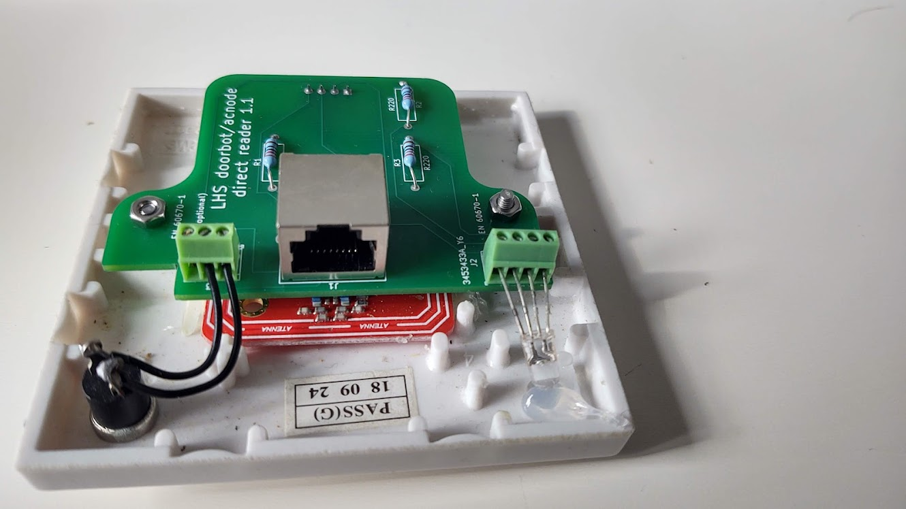

# AC node / doorbot breakout board
rev 1.1a

Designed in kicad 6

designed to connect an RJ45 socket to an Elechouse V4 NFC module
without spaghetti wiring.

Inspired by Liam's solder-pad version.

Initial revision of this is targeted at EN 60670-1 socket back-boxes / blanking plate builds as used by Doorbots.
There's no reason not to use them for acnodes as well, but a near-future revision (possibly before ordering the boards)
will include support for the existing boxes used for AC node builds with the massive arcade buttons, by means of different
mounting holes.

# Errata

rev 1.1: J2 RGB LED silkscreen is labelled backwards. Should read B- G- +5 R-, with R- closest to the middle of the board, corrected in rev 1.1a
